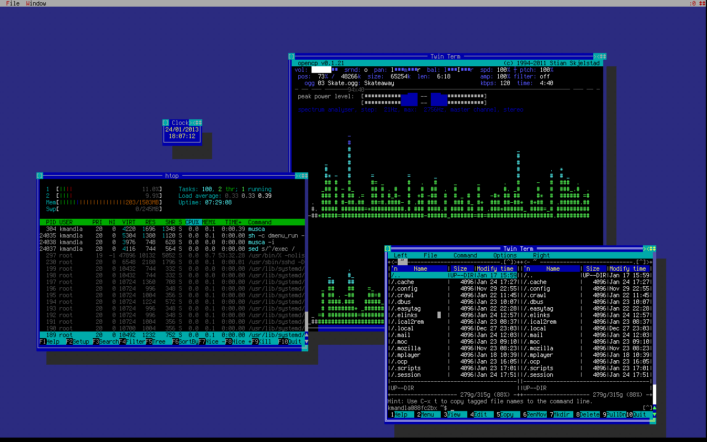
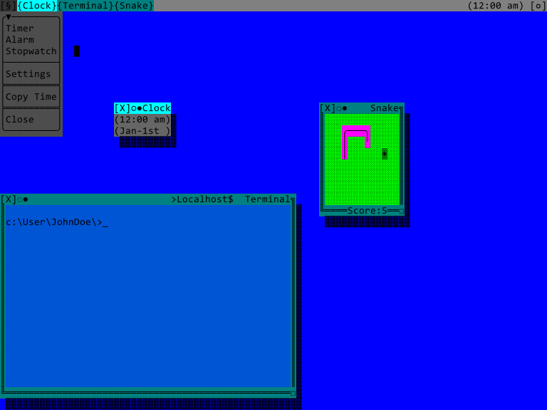
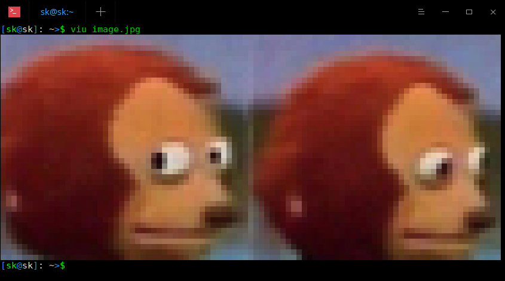

# Text-mode hacking game

> **This page is still under construction, please come back later.**

> **I think I'll break this up into multiple files...**

A Text-mode User interface based hacking game, entirely run from the terminal, using only 256 color XTERM if possible.

## To Do:
- [ ] Add vision for game world
    - [ ] The world
        - [ ] Technology differences
        - [ ] Time & the progression of time
        - [ ] Everything is interconnected
        - [ ] Looming loss of freedoms
    - [ ] The City
        - [ ] City state
            - [ ] comparisons to current city states
        - [ ] Decline into corruption
            - [ ] monopolization by corporations
            - [ ] Increasing control drive of the government over the people
        - [ ] Politics
            - [ ] Corruption
        - [ ] State Control
        - [ ] Corporate control
    - [ ] The factions
        - [ ] The corporations
            - [ ] Corporate enforcement
        - [ ] The government
            - [ ] The Police
            - [ ] Other government institutions
        - [ ] The public
        - [ ] The Press
            - [ ] News
            - [ ] Newspapers
            - [ ] Journalism
        - [ ] The Public services
            - [ ] Utilities
        - [ ] The criminal organizations
            - [ ] Explain hats
                - [ ] White hat
                - [ ] Black hat
                - [ ] Gray hat
            - [ ] Criminal gangs
            - [ ] Vigilante groups
        - [ ] The Other hackers
            - [ ] Player tutorial group
            - [ ] Hobbyist group
            - [ ] Protest group
            - [ ] Activist group
        - [ ] Economic classes
    - [ ] The People
    - [ ] The network/internet
        - [ ] Websites
        - [ ] Services
        - [ ] Hidden services & websites
    - [ ] (Alternate) History of the wold
        - [ ] The how and why of TUI use
        - [ ] Why everything is connected
    - [ ] Look and feel of the world and The City
        - [ ] Representation to the player
        - [ ] Buildings
            - [ ] Towers
        - [ ] Streets
- [ ] Add thoughts on how to generate world
    - [ ] Generating for simulation
    - [ ] Generating People
        - [ ] NPC personality generation
    - [ ] Generating Organizations
        - [ ] Corporations
        - [ ] Government
            - [ ] Police
        - [ ] Public services
        - [ ] Criminal organizations
        - [ ] Hacker groups
        - [ ] Others
    - [ ] Generating the map
        - [ ] Generating apartment/office layout
            - [ ] And their networks
        - [ ] Generating building layouts
            - [ ] And their networks
        - [ ] Generating streets & city blocks
            - [ ] And their networks
    - [ ] Generating the networks
    - [ ] Generating the devices
        - [ ] Computers
        - [ ] Nodes
        - [ ] Servers
        - [ ] Databases
        - [ ] Other devices
- [ ] Add vision for simulation
    - [ ] Person simulation
            - [ ] Stats
            - [ ] Routines
            - [ ] Minds
            - [ ] Intercommunication
            - [ ] Interaction
        - [ ] Adding & removing people
- [ ] Add vision for the look and feel
    - [ ] Explain TUI
    - [ ] Add vision for TUI based game
- [ ] Add vision for networking
    - [ ] How does everything connect
    - [ ] Simulated data flows
    - [ ] Connections & proxies
- [ ] Add vision for Gameplay
    - [ ] Add vision for systems use
    - [ ] Add vision for NPC interaction
    - [ ] Add vision for inventory system
    - [ ] Relations with NPCs
    - [ ] Add vision for location traversal
        - [ ] NPCs moving
        - [ ] The player moving
        - [ ] Navigable locations
            - [ ] Apartments & offices
            - [ ] Player home
            - [ ] Streets
            - [ ] Buildings
            - [ ] Other locales
    - [ ] Visual representation for moving
- [ ] Add vision for hacking
    - [ ] Add vision for hacking tools
    - [x] Add vision for tracing
    - [ ] Add vision for being traced
- [ ] Add vision for hardware
    - [ ] Add vision for computers
    - [ ] Add vision for networking nodes
    - [ ] Add vision for servers
    - [ ] Add vision for other devices
- [ ] Add vision for player story
    - [ ] The start
    - [ ] The motivation
    - [ ] Endings
- [ ] Add vision for modding
    - [ ] Adding data
    - [ ] Removing data
- [ ] Add vision for game story structure
    - [ ] The overall story
    - [ ] Background story happenings
    - [ ] Missions
    - [ ] Discovery
- [ ] Add vision for player progression
    - [ ] Add vision for rewards
    - [ ] Add vision for player "housing"
    - [ ] Add vision for player upgrading living standards
    - [ ] Reputation tracking
        - [ ] Rep with govenment
        - [ ] Rep with corporations
        - [ ] Rep with groups
- [ ] Add vision for software
    - [ ] Add vision for operating systems
    - [ ] Add vision for office software
    - [x] Add vision for files
    - [ ] Add vision for databases
    - [ ] Add vision for apps
- [x] Add Links to sources
- [ ] Add comparisons to real hacking software

***

## Intro

Imagine a city-state, the likes of Singapore, Hong Kong SAR, Monaco, and San Marino. Where the local government wants to create a police state and where the big corporations want to monopolize everything. Where everything is connected to the state owned & controlled "internet".

In this world everything has a chip in it & is connected to the internet in some way. And thusly can be hacked. But the electronics in this world never enjoyed fancy things like "ray-traced graphics" & "HD-video", no... What this world has is Text-mode user interfaces & terminals. Imagine your current UI but rendered in 256-color Box-drawing characters and  mono-spaced fonts.

### Goals

Procedurally generate a City, it's networks, people, systems, corporations, and missions.  
Make a usable Text-mode User Interface (TUI) for almost all devices.  
An engaging, hackable world that "lives".  
No immediate time pressure toward an ultimate failure state.  

### Look & feel

Have you ever used `nano` on linux , or `edit` on Ms-DOS? Those are Text-mode interfaces, now imagine a desktop: You got your taskbar(s), your desktop icons, your little clock widget, and dragable & resizable windows. All of that, but as a text-mode user interface. (with mouse support...)

A desktop manager like [TWIN](https://github.com/cosmos72/twin) fits nicely.  

Another cool one is [VTM](https://github.com/netxs-group/vtm), It makes full use of the 256 colors, working in things like gradients. They even have a live demo on ssh! Check it out on: `ssh vtm@netxs.online`

There are also some great applications that show off in this style:  
[Midnight Commander](http://midnight-commander.org/) (`mc`), [Spotify TUI](https://github.com/Rigellute/spotify-tui)(`spt`), [MapSCII](https://github.com/rastapasta/mapscii)(`mapscii`), [timg](https://github.com/hzeller/timg/)(`timg`), [VisiData](https://github.com/saulpw/visidata)(`vd`), and many more applications found [here](https://github.com/rothgar/awesome-tuis).

I've created this mockup of a TUI desktop:
  
Imagine this but with variable fonts and color themes.

### Gameplay

Hacking for fun, as a job, to gain reputation, and to "save" the Net in the city from the monopolistic corporations & oppressive government.

### Hacking

#### Traversing the networks

**Chaining access**  
In order to gain access to a PC in an apartment, you must first find it by having either an ip address:port or know the address and apt number of the building it's in.
Building router -> apartment router -> scan LAN -> connect to pc.

#### Tracing & being traced

Finding other hackers, or being found by other hackers is done through tracing connections. Whenever a connection is setup, that connection is written to the logs & when running a special command on the command line, is visible to any other connected user:  
`$who`  
`JohnDoe Term [01-01-2021 00:00:01] Localhost`  
`JohnDoe SSH  [01-01-2021 00:00:01] 10.0.0.2`  
Here John Doe is logged in on its PC, and an external connection is logged in using the same username. Indicating that Johns password has been hacked.

Connections can also be visible on the desktop UI for any logged in user, a brief notification might appear or an alert depending on the OS & software used.

Suppose a system has been hacked and is being used as a platform to launch other hacks from. You might find an active ssh connection in the logs leading to 10.0.0.2, when you look at that target device, it has an active connection to another ip! You would have to hack into the device, find the connection, hack into the next device and repeat until you find the source.

**Logs**  
Most systems will keep logs of incoming, outgoing, and terminal connections. Also a log for any and all commands issued on the device.

Any systems logs can be used to find out about past or current connections of that device. A log entry like:  
`[01-01-2021 00:00:01] SSH login successful for user:JohnDoe from 10.0.0.2:22`  
Shows that a ssh login was successful on Jan first from the ip 10.0.0.2 on port 22. This can be used to trace back where this ssh connection came from. It does not however show if the originating ip was the real origin or merely a proxy.

Database logs can show who edited what record at what time:  
`[01-01-2021 00:00:01] User:JohnDoe edited to table:"Drivers licenses" record:1234`  
This shows that John Does account changed some data, if you then check the accounts log for when & from where it logged in, this change can be traced.

Systems keep logs only for a limited time, say one week, to keep it from clogging up the drives.

**Active connections**  

**Warning programs/scripts**  

**Disconnect**  

**Fake logs & framing them**  

#### Remote desktop, web-management, and terminal access

When accessing a system or device, you'll be presented with one of several options:  
* Remote Desktop - This is a computers desktop displayed in a window on your PC. You can interact with is as if it were  your own desktop. In some cases this connection is a live view of the remote desktop.
* Web-management - This is a "website" hosted by the target device. Opened in your web-browser, this website contains some simple options for the device or  displays info on the device. If you've ever had to set up your home router, it's like that.
* Terminal - The most universal & most prevalent interfacing method. Almost all devices have a way to connect to its terminal interface. And in this world, over the internet!

When connecting to a system, you can for the most part detect which of these options are available. A firewall may allow direct terminal connections trough but not remote desktop, in such cased you'd have to hack into a device  behind the firewall via the terminal, then pipe the remote desktop trough it.

**Remote desktop**  
The remote desktop is simply a window on your desktop that shows a remote one. The remote desktop may show an alert or notification that a connection has been set up.  
The remote desktop allows you to log in as a user of the target system would and you'd be able to do whatever they could.

You can also copy data & files to and from the remote desktop.

Live viewing of a remote desktop will show a permanent notification it the target desktops taskbar.

**web-management**  
These are websites served by devices connected to the network, for example:  
A printer would show a page with status about the printer, a page where you can upload a document to be printed, a settings page, and a page where you can download printed/scanned documents.  
Routers, most of them at least, also have a web-management console form where you can make changes to its functions and see its current status. But also download logs, see active connections, see a list of devices connected to its internal network, see a network topology, etc.

Web-management portals can be password locked.

**terminal access**  
Almost all devices have a form of terminal access. Where you can connect via ssh, telnet, rlogin etc. And mostly require a password and/or username.  
On a terminal you can issue commands, set up connections, and other things.

What you can do on a terminal can be limited by its system, a printer won't be able to proxy connections and a smart microwave wont have database commands.

### Networks

Almost all electronic devices are in some fashion networked. That is Computers, Smart fridges, TVs, Printers, Coffee makers, implants, etc.  
They are all connected to the City Net. This is the central network of The City.

#### Network topology & networking nodes

**Network Topology**

* Wide Area Network(WAN):  
These are the DNS servers, major routers, and servers that manage the entire city state.
* Metropolitan Area Network (MAN):  
These are the routers that connect to city infrastructure systems like traffic lights. These are public WiFi routers. This is what Building routers connect to.
* Backbone Network (BB):  
This is the network of an apartment or office building. Control systems of the building are connected to this network. this network connects all apartment/office LANs to the MAN via the building router.
* Local area Network (LAN):  
This is the network of each individual apartment/office in a building. All devices inside a single apartment or office are connected to/via them. They each have a router that connects the LAN to the BB. (regardless of the amount of devices connected in a LAN, like 100s of PCs in a single office, it still is a single LAN)
* WiFi:  
WiFi is its own network at the MAN level, it provides connectivity to the internet for wireless devices. Only a single WiFi service is available in the city: City Net WiFi.

**Networking Nodes**

* Router  
A router manages the traffic between two or more networks.  
Routers have a list of all devices connected to the internal networks. a topology map can be made from these.  
Routers have two or more "sides" to them:
	* One "external" side - The side that connects them to the grater network, like from the LAN to the BB.
	* At least one "internal" side - This one connects the internal network to the external one.  
* Switch  
A switch forwards traffic from one port to multiple, allowing multiple connections to come together on one connection. If a router sees multiple connected devices on a single port, that means that there's probably a switch on the network. Switches come in two forms:  
	* Smart - This switch has some limited router settings and can be accessed via a terminal.
	* Dumb - This kind of switch simple forwards traffic to all connected ports.
* Firewall  
A firewall blockades unwanted network traffic.  
All firewalls are network devices in this world, a PC or server won't have its own software firewall.
* Access Point  
An access point provides routing for wireless systems over WiFi.  
As all WiFi is public and controlled by the City Net, you won't find these in peoples homes or offices. When hacking into the Public WiFi system one can track connected devices on the map or hack into the access points themselves to alert when a specific device is nearby.

### Devices

There are many kinds of devices in the City, almost all of them have a connection to the City Net in some way. Those that do always have a hack-able management system.

#### Networking nodes

**The router**  
**The switch**  
**The firewall**  
**The access point**  

#### Computers & servers

**Computer**  
**Server**  
**Network Attached Storage (NAS)**  
**Printer**  
**Office printer**  

#### "Smart" devices

**TV**  
**Doorbell**  
**Kitchen appliance**  
**Sound system**  
**Game system**  
**Lighting system**  

#### Wireless devices

**Wireless PC**  
**Cellphone**  
**Personal digital assistant (PDA)**  

#### Other systems

**Control sytems**  
**Security systems**  
**Public kiosks**  
**Advertisement screens**  

### World simulation

#### Procedural generation

**Generating the city and its contents**

**Generating the NPCs**  
What I expect is, you simply create some lists (.json files?) with names, brands, jobs, street names, network addresses, etc and have the simulator choose from those lists a random item to create in the world, then keep track of that thing while it simulates.

So to create Jane Doe, who lives in apt.5 on streetname, a type 3 apartment, with a PC model: z123.  
The generator would choose from the table Firstnames, "Jane", from Lastnames, "Doe", select a street from the streets list, choose an available apartment number on that street name, check what type of apartment that would be, and finally choose a PC from the computers list.

### Programs & files

Programs do things on the computer, whereas files only contain data. A program can be in the form of a file or a running script. Some programs need files to function, as input, or as output, or as any combination of those.

Programs (that are files) and files can be moved or copied between systems. Files have a size to them, that size corresponds to its contents of data.

File systems will not be considered beyond simple `format c:` commands or secure erase vs. deleted file recovery. 

#### Directory structure

Filesystems will be based on drives like the `c:` drive or `$q:` drive for "remote" drives. Each hardware "disk" or data storage medium will be its own "drive".

Most PCs wil have a directory structure like this:  
`c:\` - root.  
`c:\Users` - users folder, this contains all user folders on the system.  
`c:\Users\JohnDoe` - User folder for JohnDoe user account, by default this user can only create & edit files here.  
`c:\Users\JohnDoe\Documents|Music|Downloads|Images|Contacts|Mail` - JohnDoes user folders.  
`c:\OS` - Operating system files, by default most of these can't be accessed. This can have different names based on the brand of OS.  
`c:\Settings` - Contains settings files for the OS, the Desktop, and all programs. Settings for each program are in sub-folders with the same program name. By default, users cannot access these, but Andmin users can.  
`c:\Programs` - Contains executable programs and Libraries. Each program is in its own sub-folder.  
`c:\Programs\OS|Main|Default` - default programs that come with the system.  
`c:\Logs` - Contains logging files. By default inaccessible by users except Admin users.

Other drives will have different drive letters like: `a:` & `b:` for the floppy drives, `d:` for an extra hard drive, and `e:` for the plugged in USB stick. users will have access to these drives, and programs can run off these. However, these drives can be marked as read-only.

#### Files & file formats

There are many different kinds of files. Some files are user created and some are created by the programs.

User files like documents, spreadsheets, presentations, text files, music, etc. Are created by using programs. A word processing program, for example, would save a document in the `.doc` format and only a word processing program can open this `.doc` file.

A `.doc` can be edited by other programs, like the note taking app, but it would in some ways garble the contents. Think more old school Microsoft Office files and less modern open-document formats.

Image files are rendered as ANSI text. When viewed in a text editor, one would see something like this:
> [K [10;34H [1K(0 [0;1m [37m  
> [34m [47m(0 [0;1m [37m [47m  
> [44m [K [11;34H [1K(0 [0;1m  
> 47m [48X [11;84H (0 [0m [30  

("video" files, I think, would just have to be animated gifs rendered in text.)

#### Databases & mass storage

Databases contain vast amounts of data in records, or rows like in a spreadsheet. Data in such databases can be connected to other data. For example: A drivers license database is connected to the identities database.

Databases often have a system to query data. For example: Searching the drivers Lisence database for the name John Doe.  
These systems can also edit, add or remove records. This however will be logged.

There are also mass storage systems of files, usually in the for of network attached storage (NAS) systems. these usually contain a very large amount of files, or just very big files.

#### Applications (apps), libraries, scripts.

Applications (apps) are the programs a user utilizes to do stuff on a computer. Documents are processed by the word processing app, web browsing is done on the Internet app, and playing music is done by the tunes-player app, etc.

Some programs require extra data in the form of libraries. These library files contain data or embedded files that the program can use in certain situation to preserve memory while it's running. A clock app won't need the data on all timezones in the whole world if it's only displaying the local time.

Scripts are bits of text, lists of terminal commands, that act like a program. these scrips can also be input to the command line as a single command, therefore running in memory and never being a "file".

#### Coding scripts & programs

**Code blocks**  

(Reference [google blockly](https://blockly-demo.appspot.com/static/demos/code/index.html) & [Scratch](https://scratch.mit.edu/) in this part)

***

### Other hacking games

There are various games I drew inspiration from, such as these:

* [Hacknet](https://hacknet-os.com/) - Mostly for the command line usage.
* [Uplink](https://store.steampowered.com/app/1510/Uplink/) - For the "hacking as a job" aspect and mission style.
* [HackMUD](https://www.hackmud.com/) - For the command line scripting and "real time" aspects of hacking.
* [Exapunks](https://www.zachtronics.com/exapunks/) - for writing small programs that make the robots do stuff.

### Comparisons to real "hacking" software

(Add comparisons to tools listed [here](https://tools.kali.org/tools-listing) on the kali linux tools page.)

## Links:

Here are some various links to other Github places that I used for inspiration:  
Rothgars list of [awsome TUIs](https://github.com/rothgar/awesome-tuis).  
Cosmos72s Text mode windows enviroment - [TWIN](https://github.com/cosmos72/twin)  
Netxs-groups [VTM](https://github.com/netxs-group/vtm)

And some sources for the images:  
TWIN desktop from [here](https://inconsolation.wordpress.com/2013/01/24/bonus-twin-bigger-and-better-than-ever/).  
Image as text from [here](https://ostechnix.com/how-to-display-images-in-the-terminal/).  
